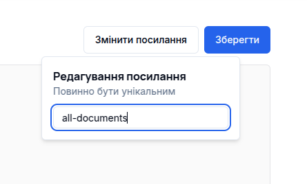
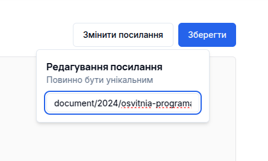

# [ODPK](https://odpk.vercel.app/)

Revamping college's website. This is a [Next.js](https://nextjs.org/) project bootstrapped with [`create-next-app`](https://github.com/vercel/next.js/tree/canary/packages/create-next-app).

# Tech stack

- Framework: [Next.js](https://nextjs.org)
- Styling: [Tailwind CSS](https://tailwindcss.com/)
- UI Components: [shadcn/ui](https://ui.shadcn.com/)
- Animations: [Framer](https://www.framer.com/motion/)
- Table package: [TanStack/react-table](https://tanstack.com/table/latest)
- Database: [Prisma](https://www.prisma.io/)
- Validation: [Zod](https://zod.dev)
- Markdown: [Contentlayer](https://contentlayer.dev/)

# Features

- Server-side pagination
- Reusable data-table component
- Authorization implementation via [next-auth](https://next-auth.js.org/)
- Editor component for easy news editing
- Usage of markdown(mdx)
- Image storage in [uploadthing](https://uploadthing.com/)

# Running locally

1. Clone the repository

   ```bash
   git clone https://github.com/NaotoAzazel/odpk
   ```

2. Install dependencies using npm
   ```bash
   npm install
   ```
3. [Configure](#customizing-env) environment file

4. Usage locally
   ```bash
   npm run dev # run the application in development mode
   npm run build # compile current version of the website
   npm run start # start the website in production mode
   ```

# Customizing .env

> **Important**: if you add a variable in `.env`, you should also add the same variable in `src/env.js`. All client-side variables should be prefixed with: `NEXT_PUBLIC_`.

First, copy `.env.example` to `.env`.

```bash
cp .env.example .env
```

## Setting

### Database

We will start by setting up our database. You can use any Postgres. Get the variables from your database environment and paste them into `.env`. When you've inserted all the variables associated with the database use the following command.

```bash
npm i -g prisma
prisma db push
```

> Note: If you are using an environment file called like this: `.env.development` or `.env.production`, then use the following command.

```bash
npm install -g dotenv-cli
dotenv -e .env.[development/production] -- prisma db push
```

### Uploadthing

Now we should get the api keys for uploadthing. Go to [website](https://uploadthing.com/) and sign in. Create new application, or use an existing one. Navigate to `API Keys` in the left sidebar menu, copy `UPLOADTHING_SECRET` and `UPLOADTHING_APP_ID` and paste them into `.env`.

### Redis

For Redis we need to get two api keys. Go to [Upstash](https://upstash.com/), create **Redis database**, go to details tab, scroll down to `REST API`, copy `UPSTASH_REDIS_REST_URL`, `UPSTASH_REDIS_REST_TOKEN` and paste them into `.env`.

### Other

The auth variables: `NEXTAUTH_SECRET` can take any value.

> **It is desirable to make this field long and completely random, you can use this [randomkeyget](https://randomkeygen.com/)**.

`NEXT_PUBLIC_APP_URL` in development mode paste your `localhost`, and in production paste the url to your site.

# Markdown

> **Important**: each markdown must be starts with:

```html
---
title: Your title here
---
```

All markdowns are stored in the `src/content/pages`. The path for each page generated in this way: to add a page about the director, for example, the following steps should be followed:

1. Create a folder in the `src/content/pages` and name it `director`.

2. Create the file `index.mdx` and fill it with the [code](#markdown-elements).

The file name affects on url to the page. File with name `index.mdx` mean, that its root page in current path.

Let explain an example of nesting a file inside a folder. If we want to visit `*/director/merits` after `*/director`, we need to create another file in the `director` folder and name it `merits.mdx`.



So now explain a longer path nesting: folder -> folder -> ... -> file. Now we want to visit `*/director/merits/some-another-path`, for this we change `merits.mdx` to folder `merits`, in `merits` folder create `index.mdx`, in which trasfer code from the recently deleted `merits.mdx`, and another file called `some-another-path.mdx`.



## Custom component

You can use components that have already been written, such as:

```md
import { Button } from "@/components/ui/button";

import { ResponsiveImage } from "@/components/responsive-image";
import Image from "@/assets/images/landing.jpg";

<Button>Some text here</Button>
<Button variant="outline" size="sm">Button with props</Button>

<ResponsiveImage 
  src={Image} 
  width={1000} 
  height={1000} 
  alt="Example-image-component"
/>
```

## Style guide

The `@tailwindcss/typography` plugin gives us the opportunity to write styles for any HTML tag using Tailwindcss. Here is how it do:

```html
import { NewsCardSkeleton } from "@/components/skeletons/news-card-skeleton";

<div className="grid grid-cols-2 gap-2">
  <NewsCardSkeleton />
  <NewsCardSkeleton />
</div>
```

## Markdown elements

You can read about basic markdown syntax [here](https://docs.github.com/en/get-started/writing-on-github/getting-started-with-writing-and-formatting-on-github/basic-writing-and-formatting-syntax).

# Code styling

Recommend to use the `Prettier` extension, `.prettierrc` file already configured.

# Package versions

- node: v20.16.0
- npm: v10.8.1
